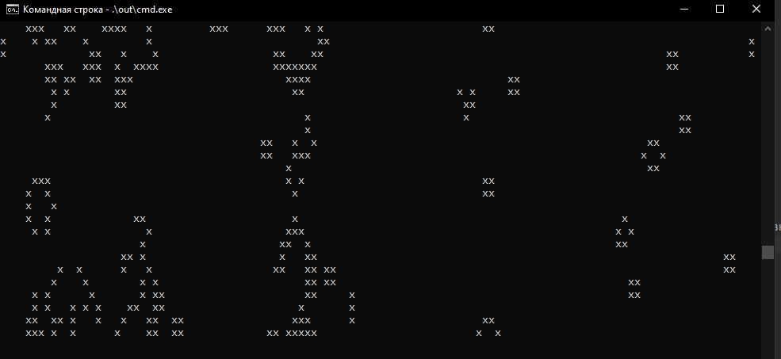

# The Game of life on Go

### Встановлення та запуск
+ В залежності від операційної системи завантажити та встановити Go:   
[https://go.dev/doc/install](https://go.dev/doc/install).

+ Завантажити  репозиторій на локальну машину та перейти до нього:
```
git clone https://github.com/samurai-of-honor/game-of-life.git
```
```
cd game-of-life
```
+ Для запуску тестів:
```
go test ./...
```

+ Для запуску програми у режимі читання поля з файлу або у режимі візуалізації 
виконати команду замінивши `mode` на `file` або `cmd` відповідно:
```
go run ./mode
```
+ Для компіляції та запуску програми у режимі читання поля з файлу або у режимі візуалізації
  виконати команду замінивши `mode` на `file` або `cmd` відповідно::
```
go build ./mode
```
```
./mode
```


### Використання
#### Режим читання поля з файлу
Початковий стан гри задається в файлі `startUniverse.txt` в папці `file`.  
Після запуску програми кінцевий стан гри записується в файл `resultUniverse.txt` папки `out`.

```
                          |startUniverse|       |resultUniverse|
                          |-------------|       |--------------|
 кількість поколінь //    |3            |       |........      |
   розмірність поля //    |8 5          |       |........      |
початковий стан гри //    |........     |       |.xxx....      |
                          |..x.....     |       |........      |
  x - жива клітинка //    |..x.....     | -->   |........      |
. - мертва клітинка //    |..x.....     |       |              |
                          |........     |       |              |
```

#### Режим візуалізації
Створюється поле розміром з термінал та заповнюється випадковими значеннями 
і запускається гра.


### Автор: 
***Баран Павло Юрійович, ІП-03***
